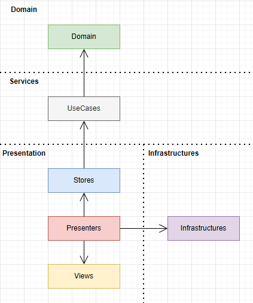

# MGSP PhotoPuzzle

> 一款基於 Unity 開發的照片拼圖遊戲，採用部分 Clean Architecture 設計思路，展示輕量級遊戲開發架構設計。

## 🎮 遊戲介紹

### 遊戲目標

將所有被打亂順序的拼圖碎片，透過**交換位置**的方式，在固定的盤面上還原成一幅完整的原始圖像。

### 🎯 遊戲特色

- **多種難度**：支援 3×3 到 7×7 的盤面大小選擇
- **隨機圖片**：整合 Lorem Picsum API，提供豐富的圖片資源
- **即時預覽**：隨時查看原圖提示，幫助完成挑戰

### 🕹️ 遊戲玩法

1. **設定挑戰**：選擇盤面大小，系統自動載入隨機圖片
2. **交換碎片**：點選第一塊拼圖碎片，再點選第二塊，兩者位置即會交換
3. **完成挑戰**：持續交換直到所有碎片歸位，還原完整圖像即獲勝！

## 🔧 技術棧

### 第三方套件
- **[VContainer](https://vcontainer.hadashikick.jp/)**：輕量級依賴注入容器
- **[UniTask](https://github.com/Cysharp/UniTask)**：高效的無分配 async/await 整合
- **[MessagePipe](https://github.com/Cysharp/MessagePipe)**：高效能訊息傳遞和事件系統
- **[R3](https://github.com/Cysharp/R3)**：現代化 Reactive Extensions (Rx) 實作

### 外部服務
- **[Lorem Picsum](https://picsum.photos/)**：隨機圖片 API 服務

## 📂 專案結構
```
Runtime/                           
├── Contexts/               # 應用程式上下文管理，處理依賴注入和全域狀態
├── Domain/                 # 領域層，包含業務邏輯和核心實體
├── Infrastructures/        # 基礎設施層，外部功能實現
├── Presentation/           # 展示層，負責 UI 相關邏輯
│   ├── Routes/             # 應用程式流程控制
│   ├── Presenters/         # 展示器，處理 UI 邏輯和用戶互動
│   ├── Stores/             # 狀態管理，儲存應用程式狀態資料
│   └── Views/              # UI 視圖元件，純 UI 顯示邏輯
└── Services/               # 服務層，提供各種應用程式服務
    ├── Events/             # 事件系統，處理遊戲事件通知
    ├── Repositories/       # 資料存取層，管理遊戲資料
    └── UseCases/           # 用例層，封裝具體業務操作
```


## 🏗️ 架構設計



本專案採用 **Package by Layer** 的模組分割策略，並有以下設計原則：

- ✅ **單向依賴流**：確保依賴關係朝向穩定的方向流動
- ✅ **關注點分離**：每個層級都有清晰的職責邊界
- ✅ **可測試性**：Domain 層完全獨立，易於單元測試
- ✅ **簡化抽象**：根據專案規模適度簡化，避免過度工程化

**簡化說明**：
- Presentation 可直接依賴 Infrastructures（簡化 API 呼叫）
- Repositories 直接實作在 Services 內（避免輕量級專案過度抽象）

## 📚 模組介紹

### Domain
**依賴**：無

Domain 層採用物件導向設計，遵循 CQS（Command Query Separation）原則。核心思路是實踐純粹的**業務規則**，不包含任何外部依賴或主動通知機制。

**設計目標**：讓 Services 層能透過 Domain 組合出各種遊戲玩法的可能性。

**主要元件**：
- `Game` 類別：封裝拼圖邏輯，提供 `Swap()` 命令和 `CheckWin()` 查詢方法

---

### Services
**依賴**：Domain

透過調用 Domain 完成業務操作。這一層是 Domain 與整個應用程式的重要邊界，定義了應用程式真正需要展現的資料型態。

**核心職責**：
- 封裝業務操作為 UseCase (採用事務腳本模式)
- 為 Presentation 層的「呈現」職責鋪路
- 處理外部 Server API 呼叫 (本專案目前沒有)
- 透過抽象介面隔離外部依賴 (本專案目前沒有)

**主要元件**：
- `CreateGame`、`SwapPieces`：核心遊戲邏輯 UseCase
- `GameEventEmitter`：遊戲事件發送器
- `GameRepository`：遊戲實例管理

---

### Infrastructures
**依賴**：Services（可選）

提供支援應用程式運作的基礎功能實作。當功能有替換可能時，由 Services 層定義抽象介面，再由此層實作。

**主要元件**：
- `LoremPicsumImageProvider`：整合 Lorem Picsum API 提供隨機圖片

---

### Presentation
**依賴**：Services、Infrastructures（可選）

採用標準 MVP 模式，由 Stores - Presenters - Views 三層組成，其中 Views 為 Passive View。

**架構特色**：
- **Store**：作為單一數據源 (Single Source of Truth)，保存應用程式狀態
- **Presenter**：處理 UI 邏輯和使用者互動
- **View**：純粹的 UI 顯示元件
- 透過 RX 和 Pub/Sub 機制通知狀態變化

**主要元件**：
- `GamePlayStore`：遊戲狀態管理
- `PhotoStore`：圖片資源管理
- `OptionStore`：遊戲設定管理

---

### Contexts
**依賴**：所有模組

負責依賴注入的定義與配置，整合所有模組並建立依賴關係。

**主要元件**：
- `AppContext`：使用 VContainer 進行依賴注入配置

